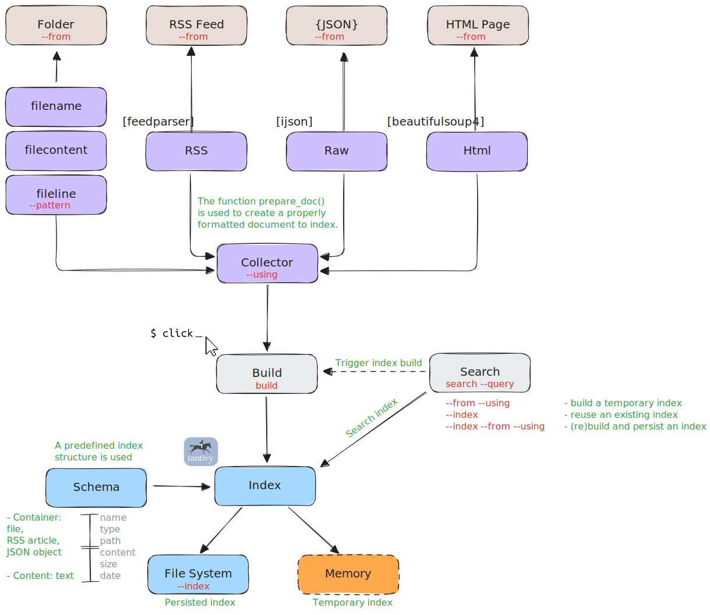

# From Idea To Delivery - A Coding Journey

> I couldn't find it, so I built it.

Slack Meetup Python Rennes

<center></center>

note:
Presentation for the Meetup [Horsebox, de l'idée à la réalisation - retour d'expérience](https://www.meetup.com/python-rennes/events/307955357/).  
The symbol 💻 means there is a demonstration.

--

## About Me

Michel CARADEC (michel@reech.com)

Lead Software & Data Engineer @ Rocket Marketing

<center></center>
<center></center>
<center></center>

note:
At Reech, we use Python for data gathering.  
Watch the presentation [Python at scale - a Reech case-study](https://www.youtube.com/watch?v=Jj3GRaOMpI8) to know more about Reech.

--

## Agenda

- How It Started - Motivations.
- Looking For A Tool.
- Building.
  - `uv`.
  - Tantivy.
  - Click.
- Distributing.
- Using.
- How It Ended - Feedback.

*Source code: <https://github.com/michelcaradec/horsebox>.*

*Package: <https://pypi.org/project/horsebox/>.*

---

## How It Started - Motivations

- Personal project to migrate **Evernote** notes to GitHub.
- **Search** feature required.
  - First on **text** files (Markdown).
  - Then why not on **other** datasources?

Need for a tool 🛠:

- Simple to use.
- Easy to install.
- No external dependencies.

*<https://github.com/michelcaradec/evernote-migration>*

--

### Looking For A Tool

| Tool                                                       | Fuzzy Search | Advanced Search | Index Persistence | Datasource | Maturity Score |
| ---------------------------------------------------------- | :----------: | :-------------: | :---------------: | ---------- | :------------: |
| [ripgrep](https://github.com/BurntSushi/ripgrep)           |    regex     |                 |                   | file       |      ★★★       |
| [fzf](https://junegunn.github.io/fzf/)                     |      X       |        ~        |                   | file       |      ★★★       |
| [television](https://github.com/alexpasmantier/television) |      X       |                 |                   | file       |      ★★★       |
| [lucene-grep](https://github.com/dainiusjocas/lucene-grep) |      X       |        X        |                   | file       |       ★★       |
| [codesearch](https://github.com/ajitesh123/codesearch)     |              |        X        |         X         | file       |       ★        |
| [tantivy-cli](https://github.com/quickwit-oss/tantivy-cli) |      X       |        X        |         X         | jsonl      |      ★★★       |

note:
By "Advanced Search", we mean support of features such as logical operators (`AND`, `OR`, `NOT`), proximity search, etc. (see [Tantivy's query parser](https://docs.rs/tantivy/latest/tantivy/query/struct.QueryParser.html)).  
The "Maturity Score" is a self-made KPI that indicates the tool level of functionality / maintenance. For example, `lucene-grep` has a good feature coverage, but is not maintained anymore.  
Even though `codesearch` relies on Tantivy, it doesn't offer fuzzy search, as it is not supported by Tantivy query parser (see <https://github.com/quickwit-oss/tantivy/issues/2576>). `codesearch` is more like a proof-of-concept, leading to a low maturity score.

--

### Links

- ripgrep: https://github.com/BurntSushi/ripgrep.
- fzf: <https://junegunn.github.io/fzf/>.
- television: <https://github.com/alexpasmantier/television>.
  - VSCode extension: <https://marketplace.visualstudio.com/items?itemName=alexpasmantier.television>.
- lucene-grep: <https://github.com/dainiusjocas/lucene-grep>.
- codesearch: <https://github.com/ajitesh123/codesearch>.
- tantivy-cli: <https://github.com/quickwit-oss/tantivy-cli>.

--

### Investigation Conclusions - 1

- `codesearch` was close to what I wanted, but I discovered it too late.
- `tantivy-cli`:
  - Requires some effort to index from **JSON files**.
  - Exposes an **API** on a port = resource usage/setup effort.
- `codesearch` and `tantivy-cli` both use **Tantivy**, a full-text search engine library.

--

### Investigation Conclusions - 2

All these tools are good, but:

- Implementing my own is **fun**.
- I will hopefully **learn** things.
- No matter, I wanted a good reason to use **Tantivy**. 🤓

note:
There are many other tools built on Tantivy: <https://github.com/search?q=tantivy>.  

---

## Building

--

### Project Bootstrap

Using `uv`:

```bash
uv init --app --package --python 3.10 horsebox

cd horsebox

# Will create a virtual environment `.venv`
uv add beautifulsoup4 "click>=8.1.8,<8.2.0" feedparser ijson tantivy

uv add --optional dev ruff
```

💻

note:
"Let's start by creating a new project."  
The version of the library can be constrained, such as for Click.

--

### Project Configuration

Entry points for the command line tool:

```toml
[project.scripts]
horsebox = "horsebox.main:main"
hb = "horsebox.main:main"
```

Project structure:

```raw
src/
  horsebox/
    main.py
      def main() -> None:
        ...
```

note:
Show the content of the file `pyproject.toml`: Python version, dependencies.  
Then manually add the section `project.scripts`.

--

### Tantivy

> A full-text search engine library inspired by Apache Lucene and written in Rust.

Used through [tantivy-py](https://github.com/quickwit-oss/tantivy-py), Python bindings for Tantivy.

<!-- Few features: -->

- [Fuzzy search](https://docs.rs/tantivy/latest/tantivy/query/struct.FuzzyTermQuery.html): `Python~1` ≈ `Pithon`, `Rennes~2` ≈ `Rene`.
- [Match phrase](https://docs.rs/tantivy/latest/tantivy/query/struct.PhraseQuery.html): `"Meetup Python Rennes"`.
- Proximity search: `"Meetup Rennes"~1`.
- Boosted search: `Meetup Python^2.0 Rennes`.
- [Persisted](https://docs.rs/tantivy/latest/tantivy/index/struct.Index.html#method.create_in_dir) / [Memory](https://docs.rs/tantivy/latest/tantivy/index/struct.Index.html#method.create_in_ram) index.
- And [many more](https://github.com/quickwit-oss/tantivy?tab=readme-ov-file#features)...

*<https://github.com/quickwit-oss/tantivy>*

note:
"Now we have a project, it's time to talk about the core technology without which all this would not be possible: Tantivy."  
Also talk about Quickwit (<https://quickwit.io/>).  
Documentation: <https://tantivy-py.readthedocs.io/> and <https://fulmicoton.gitbooks.io/tantivy-doc/content/>.  
See also <https://docs.rs/tantivy/latest/tantivy/query/struct.QueryParser.html>.  
To know more on search engine, see <https://gitlab.com/reech-oss/lectures/insa-lectures/insa-lectures-search>.  
Other resources: <https://fulmicoton.com/posts/behold-tantivy/>, <https://fulmicoton.com/posts/behold-tantivy-part2/>.

--

#### Why Not Using PyLucene?

- Requires **Java Virtual Machine**.
- Not as easy to install as Tantivy:
  - Tantivy is just **one** binary.
- Tantivy is approximately **[2x faster](https://tantivy-search.github.io/bench/)** than Lucene.

*<https://lucene.apache.org/pylucene>*

note:
Benchmark: <https://tantivy-search.github.io/bench/>.

--

### Click

> A composable command line interface toolkit.

<!-- Few features: -->

- **Easy** declaration of arguments (`@click.option`).
- Auto **documentation**.
- Typo-errors assistance:

    ```raw
    Error: No such option: --highligh Did you mean --highlight?
    ```

*👀 Meetup [C'est CLI qui gagne? Les outils pour faciliter la création de CLI en Python](https://www.meetup.com/python-rennes/events/292337226/).* 🤓  
*👀 Meetup [Interfaces graphiques web en Python - retours d'exp. NiceGUI, Gradio, Streamlit](https://www.meetup.com/python-rennes/events/297067182/).* 🤓

*<https://pypi.org/project/click>*

note:
"We need a library to facilitate the development of a CLI application."

---

## Distributing

--

### Dependencies Check

Using [pipask](https://pypi.org/project/pipask/):

- Check package **reputation**, metadata, and **vulnerabilities**.
- Ask for **consent** before installing.

```bash
# Single library
uvx --with pip pipask install tantivy --dry-run

# All libraries
uv pip freeze --exclude-editable > requirements.txt
uvx --with pip pipask install -r requirements.txt --dry-run
```

```raw
Package check results:
  [tantivy==0.24.0]
    ! Repository has less than 1000 stars: 330 stars
    ✔ 76,811 downloads from PyPI in the last month
    ✔ The release is 1 day old
    ✔ No known vulnerabilities found
    ✔ No development status classifiers
    ✔ Package is licensed under MIT
```

💻

*<https://pypi.org/project/pipask>*

note:
"Let's ensure that we do not use a bad library."  
`uvx` is equivalent to `uv tool run`. Tools are installed into temporary, isolated environments.  
See also [Pipask: Check Your Python Dependencies Before They Bite](https://medium.com/data-science-collective/pipask-know-what-youre-installing-before-it-s-too-late-2a6afce80987).

--

### License check

Using [LicenseCheck](https://github.com/FHPythonUtils/LicenseCheck/):

```bash
uvx licensecheck --format ansi \
  --only-licenses apache bsd isc mit mpl python unlicense \
  --fail-licenses gpl
```

```raw
                List Of Packages
┏━━━━━━━━━━━━┳━━━━━━━━━━━━━━━━━━━┳━━━━━━━━━━━━━┓
┃ Compatible ┃ Package           ┃ License(s)  ┃
┡━━━━━━━━━━━━╇━━━━━━━━━━━━━━━━━━━╇━━━━━━━━━━━━━┩
│ ✔          │ beautifulsoup4    │ MIT LICENSE │
│ ✔          │ click             │ BSD LICENSE │
│ ✔          │ feedparser        │ BSD LICENSE │
│ ✔          │ ijson             │ BSD LICENSE │
│ ✔          │ sgmllib3k         │ BSD LICENSE │
│ ✔          │ soupsieve         │ MIT         │
│ ✔          │ tantivy           │ MIT         │
│ ✔          │ typing-extensions │ PSF-2.0     │
└────────────┴───────────────────┴─────────────┘
```

💻

*<https://github.com/FHPythonUtils/LicenseCheck>*

note:
"It is a good habit to check the license of the dependencies."  
See also <https://ashishb.net/programming/python-in-production-2/#keep-code-legally-compliant>.

--

### Publishing On PyPi

1. Build:

    ```bash
    uv build
    # Same as:
    # uv build --index https://pypi.org/simple/
    ```

2. Then publish:

    ```bash
    uv publish --token $TOKEN
    # Same as:
    # uv publish --publish-url https://upload.pypi.org/legacy/ --token $TOKEN
    ```

*👀 Meetup ["Dessine-moi un Python" - pour un packaging qui déboîte](https://www.meetup.com/python-rennes/events/300288648/).* 🤓

note:
"As a prerequisite, you must create an account on PyPi."  
Packaging with <https://pypi.org/project/hatchling/>.  
Extra resources: <https://thisdavej.com/packaging-python-command-line-apps-the-modern-way-with-uv/>, <https://mathspp.com/blog/using-uv-to-build-and-install-python-cli-apps>, <https://textual.textualize.io/how-to/package-with-hatch/>, <https://blog.ippon.fr/2025/05/12/uv-un-package-manager-python-adapte-a-la-data-partie-1-theorie-et-fonctionnalites/>, <https://blog.ippon.fr/2025/05/14/uv-un-package-manager-python-adapte-a-la-data-partie-2-travaux-pratiques/>, <https://realpython.com/python-uv/>.

--

### Monitoring Details & Statistics

Details:

- PyPi Browser: <https://pypi-browser.org/package/horsebox>.
- PyPi API: <https://pypi.org/pypi/horsebox/json>.

Download statistics:  
*The embarrassing moment 🫠.*

- <https://www.piptrends.com/package/horsebox>.
- <https://pypistats.org/packages/horsebox>.
- <https://pepy.tech/projects/horsebox>.

note:
pip Trends can also be used to compare packages.

---

## Using

--

### Architecture

<center></center>

note:
"Before starting using the tool, let's talk about its architecture, and how the different components interact with each other."

--

### Installing

```bash
uv tool install horsebox
# To upgrade:
# uv tool upgrade horsebox
```

Understanding `uv` tool installation:

```bash
# Tools location
uv tool dir
# /root/.local/share/uv/tools
# Check for Horsebox
ll $(which hb)
# /root/.local/bin/hb -> /root/.local/share/uv/tools/horsebox/bin/hb
cd /root/.local/share/uv/tools/horsebox/
cd ./lib/python3.13/site-packages/
# The code is under the folder `horsebox`
```

💻

note:
"The tool is installed with one single command, and can be used without any bootstrap (i.e. no interpreter installation, no environment initialization, etc.)."  
To be tested from a fresh Docker container, to demonstrate how easy it is.  
Astral proposes some Docker images with `uv` binaries: <https://docs.astral.sh/uv/guides/integration/docker/#getting-started> - `docker run --interactive --tty --name horsebox --rm ghcr.io/astral-sh/uv:debian-slim /bin/bash`.

--

### Searching - Standard Search

```bash
# Search in text files (with extension `.txt`) under the folder `demo`
hb search --from ./demo/ --pattern "*.txt" --query "better" --highlight

# Same using the line-by-line collector
hb search \
  --from ./demo/ --pattern "*.txt" --using fileline \
  --query "better" --highlight --limit 5

# View the number of results found
hb search --from ./demo/ --pattern "*.txt" --using fileline --query "better" --count

# Get the top 5 words (JSON format)
hb search --from ./demo/ --pattern "*.txt" --top --limit 5 --json
```

💻

note:
"Getting the top words can be used to build more efficient searches."

--

### Searching - Advanced Search

Fuzzy search:

```bash
# Using ready to index documents
hb search \
    --from ./demo/raw.json --using raw \
    --query "engne~1"
```

Proximity search:

```bash
hb search \
    --from ./demo/raw.json --using raw \
    --query "'engine inspired'~1" --highlight
```

💻

note:
To inspect the content of the file `raw.json`: `cat ./demo/raw.json | jq`.

--

### Searching - Technology Watch - 1

Search for [@BreizhCamp](https://www.youtube.com/@BreizhCamp) YouTube videos, using a data **pipeline**:

```bash
curl --silent "https://api.rss2json.com/v1/api.json?rss_url=https%3A%2F%2Fwww.youtube.com%2Ffeeds%2Fvideos.xml%3Fchannel_id%3DUCVelKVoLQIhwx9C2LWf-CDA" \
    | jq --compact-output '.items[] | {name: .title, content: .description, path: .link, date: .pubDate}' \
    | hb search \
        --from - --using raw --jsonl \
        --query "python" --json \
    | jq '.hits[] | (.name, .date, .path)'
```

💻

note:
`UCVelKVoLQIhwx9C2LWf-CDA` is the YouTube channel ID of `@BreizhCamp`.  
The online service <https://rss2json.com/> can be used to convert a RSS feed to a JSON file.  
The option `--jsonl` is used with the collector `raw` to handle JSON Lines data sources.

--

### Searching - Technology Watch - 2

Using the provided **RSS** collector:

```bash
hb search \
    --from "https://www.youtube.com/feeds/videos.xml?channel_id=UCVelKVoLQIhwx9C2LWf-CDA" \
    --using rss \
    --query '"tests unitaires"' --highlight
```

With **multiple** data sources:

```bash
hb search \
    --from "https://www.blog.pythonlibrary.org/feed/" \
    --from "https://planetpython.org/rss20.xml" \
    --from "https://realpython.com/atom.xml?format=xml" \
    --using rss --query "duckdb" --highlight
```

💻

--

### Searching - News Watch

Get the **top** keywords:

```bash
export HB_TOP_MIN_CHARS=4
export HB_CUSTOM_STOPWORDS=lundi,mardi,mercredi,jeudi,vendredi,samedi,dimanche
# Show configuration
hb config

hb search \
    --from "https://www.lemonde.fr/rss/une.xml" \
    --using rss \
    --top --limit 20 \
    --json \
| jq --raw-output '.keywords[].key'
```

Then **search** for articles containing the keyword of interest:

```bash
SEARCH_KEYWORD=xxx

hb search \
    --from "https://www.lemonde.fr/rss/une.xml" \
    --using rss \
    --query "${SEARCH_KEYWORD}" --highlight
```

💻

note:
The configuration environment variables are used to customize the result: 4 characters or more, exclude weekdays.  
The fuzzy search can be used to handle keywords and their plural (`soldier~1` ≈ `soldier(s)`).

---

## How It Ended - Feedback

*What was done and learnt during this coding journey.*

--

### Coding - 1

- Do not reinvent the wheel, use **existing** libraries.
  - Initial idea was to create a light package to make installation easy.
  - `uv` is so **fast** at installing dependencies that it's not worth doing it.
- Check **dependencies wheels**.
  - The Python bindings for Tantivy [tantivy-py](https://github.com/quickwit-oss/tantivy-py/) `0.22.2` had no wheel for Python 3.13 at the time of coding.
  - Use of `UV_PYTHON` to restrict the interpreter:  
    `UV_PYTHON=">=3.9,<=3.12"`

note:
See <https://github.com/quickwit-oss/tantivy-py/issues/371>.  
The setting `UV_PYTHON` is not part of the standard `pyproject.toml` configuration.  
Output extract on an OS where Python 3.13 is installed:
    ```raw
    DEBUG Searching for Python >=3.9, <=3.12 in managed installations or search path
    DEBUG Searching for managed installations at `~/.local/share/uv/python`
    DEBUG Skipping incompatible managed installation `cpython-3.13.2-macos-x86_64-none`
    DEBUG Found managed installation `cpython-3.10.16-macos-x86_64-none`
    ```

--

### Coding - 2

- `click.Path` and `open_file` to handle files and **piped** content.
- The type `Choice` in Click can be tricky with **enumerations**:

    ```python
    class Format(str, Enum):  # Should be inherited from `str` and `Enum`
        TXT = 'txt'           # Use similar names for members and values
        JSON = 'json'

    @click.option(
        '--format',
        type=click.Choice(
            list(Format),
            case_sensitive=False,  # Set to False
        ),
        default=Format.TXT,
    )
    def cmd(format: Format):
        ...
    ```

- Click requires extra coding for complex options combination.

note:
The enumeration class should be inherited from `str` and `Enum`.  
Use `case_sensitive=False`.  
Use similar names for members (`TXT`, `JSON`) and values (`txt`, `json`).

--

### Coding - 3

- Use **lazy evaluation** when possible:
  - `yield` keyword.
  - `itertools` module:
    - `itertools.chain`.
    - `itertools.chain.from_iterable`.
  - Library `ijson`.
- **IPv6** may slow down URL opening (`urllib.request.urlopen`):
  - Optionally disable it.

*👀 Meetup [Python for the muggle-born developer - lancement de la communauté Python Rennes](https://www.meetup.com/python-rennes/events/281548386/).* 🤓

note:
Performance oriented feedback.  
Using lazy evaluation allows ingesting lots of documents without exhausting memory.

--

### Coding - 4

- Keep `uv` up-to-date (frequent releases):

    ```bash
    uv self update
    ```

    ```raw
    info: Checking for updates...
    success: Upgraded uv from v0.7.3 to v0.7.6! https://github.com/astral-sh/uv/releases/tag/0.7.6
    ```

--

### Packaging - 1

- Avoid project/package name with **dash** (`-`).
- Confusion between module and package name (`-` => `_`).

--

### Packaging - 2

Use **centralized versioning** (`__version__`).

- Version defined in `pyproject.toml`:

  ```toml
  [project]
  version = "0.1.1"
  ```

- Collected in code:

  ```python
  from importlib.metadata import version

  try:
      __version__ = version('horsebox')
  except Exception:
      __version__ = ''
  ```

- Version can be updated with `uv`:

  ```bash
  uv version --bump patch [--dry-run]
  uv version --bump minor [--dry-run]
  uv version --bump major [--dry-run]
  ```

note:
The command `uv version --bump` will update the files `pyproject.toml` and `uv.lock`.  
Available since version 0.7.7: <https://github.com/astral-sh/uv/releases/tag/0.7.0>.

--

### Packaging - 3

- **Test** publish on [TestPyPi](https://test.pypi.org/) first:

  ```bash
  uv publish \
    --publish-url https://test.pypi.org/legacy/ \
    --token $TOKEN
  ```

- 💡 Tip: install from TestPyPi, using PyPi dependencies:
  
  ```bash
  uv tool install \
    --index https://pypi.org/simple/ \
    --default-index https://test.pypi.org/simple/ \
    --index-strategy unsafe-best-match \
    horsebox
  ```

note:
`--index`: the URLs to use when resolving dependencies (see <https://docs.astral.sh/uv/reference/cli/#uv-tool-install--index>).  
`--default-index`: the URL of the default package index (see <https://docs.astral.sh/uv/reference/cli/#uv-tool-install--default-index>).  
`--index-strategy`: the strategy to use when resolving against multiple index URLs (see <https://docs.astral.sh/uv/reference/cli/#uv-run--index-strategy>).

--

### Testing

Using the `doctest` module:

```bash
# Test all
python -m doctest -v ./src/**/*.py

# Test one file
python -m doctest -v ./src/horsebox/utils/batch.py
```

- ✅ Easy to write (no module import).
- ✅ Convenient for simple tests (sole functions, no mock).
- ✅ Adds extra documentation.
- ❌ No syntax check when writing.
- ❌ No support of Unicode in docstrings.

*👀 Discussed in Meetup Slack.* 🤓

note:
"I did not focus too much on unit tests for this project, but still wanted to have some for helper functions. `doctest`, by its simplicity, was a good candidate."  
To get the code coverage: `uvx coverage run -m doctest ./src/horsebox/utils/batch.py && uvx coverage report -m`.  
See <https://docs.python.org/3.10/library/doctest.html>.

--

### Environment

IDE:

- [VSCode](https://code.visualstudio.com/).

VSCode extensions:

- [Python](https://marketplace.visualstudio.com/items?itemName=ms-python.python) - Python language support:
  - [Pylance](https://marketplace.visualstudio.com/items?itemName=ms-python.vscode-pylance): Python Language server.
  - [Python Debugger](https://marketplace.visualstudio.com/items?itemName=ms-python.debugpy): Python debugger extension using debugpy.
- [Ruff](https://marketplace.visualstudio.com/items?itemName=charliermarsh.ruff): Ruff **linter** and **formatter** support.
- [SonarQube for IDE](https://marketplace.visualstudio.com/items?itemName=SonarSource.sonarlint-vscode): linter to detect & fix **coding issues** locally.

Extras:

- [PyScope](https://marketplace.visualstudio.com/items?itemName=KaustubhPaturi.py-scope): Python Code Block Highlighter.

*👀 Meetup [Hook'il est beau, notre code !](https://www.meetup.com/python-rennes/events/289052290/).* 🤓

--

### Documentation

Using VSCode and Markdown.

--

#### Code Documentation

VSCode extensions:

- [autodocstring](https://marketplace.visualstudio.com/items/?itemName=njpwerner.autodocstring): Python **docstrings** generation.
- [code-spell-checker](https://marketplace.visualstudio.com/items/?itemName=streetsidesoftware.code-spell-checker): **spell checker** for code (variable names).

note:
There is also a pre-commit hook to check Python docstrings: <https://github.com/PyCQA/pydocstyle> (not maintained anymore, Ruff as a replacement).

--

#### Text Documentation

VSCode extensions:

- [markdown-all-in-one](https://marketplace.visualstudio.com/items/?itemName=yzhang.markdown-all-in-one): Markdown under steroids.
- [markdown-footnotes](https://marketplace.visualstudio.com/items/?itemName=bierner.markdown-footnotes): **footer** notes support.
- [vscode-markdownlint](https://marketplace.visualstudio.com/items/?itemName=DavidAnson.vscode-markdownlint): Markdown **linter**.
- [spellright](https://marketplace.visualstudio.com/items/?itemName=ban.spellright): **spell checker** for text (documents, comments).
- [languagetool-linter](https://marketplace.visualstudio.com/items/?itemName=davidlday.languagetool-linter): LanguageTool linter.
  - Using Docker container <https://github.com/Erikvl87/docker-languagetool>.
  - See also "[LanguageTool pour ne plus fauter](https://blog.stephane-robert.info/docs/outils/aide/languagetool/)" by @StephaneRobert.

*👀 Meetup [Documentation : trouver son style](https://www.meetup.com/python-rennes/events/307201327/).* 🤓

note:
Mermaid support in preview: <https://marketplace.visualstudio.com/items/?itemName=bierner.markdown-mermaid>.  
Github style preview: <https://marketplace.visualstudio.com/items/?itemName=bierner.markdown-preview-github-styles>.  
PDF export: <https://marketplace.visualstudio.com/items/?itemName=yzane.markdown-pdf>.

---

## Ideas For The Future

- **Plugin** support for extra datasources (using [pluggy](https://pypi.org/project/pluggy/)).
- **Continuous** integration and **delivery** with [GitHub Actions](https://github.com/features/actions).

*👀 Meetup [Type, Plugin et Match](https://www.meetup.com/python-rennes/events/298324820/).* 🤓  
*👀 Meetup [Retours d'expérience - intégration continue et déploiement de projets Python](https://www.meetup.com/python-rennes/events/296023264/).* 🤓

note:
"The feature coverage of the tool had to be limited at some stage, so a first version could be delivered."

---

## One More Advice

> Viens au Meetup Python Rennes,  
> et à la fin c'est toi qui va coder. 🤓

<center></center>

---

## Questions & Answers

Thank you!

😄
